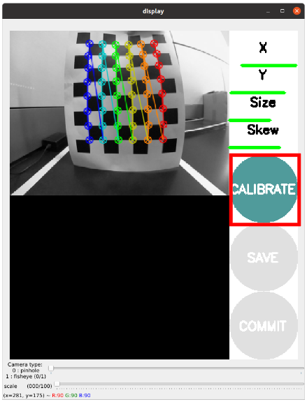
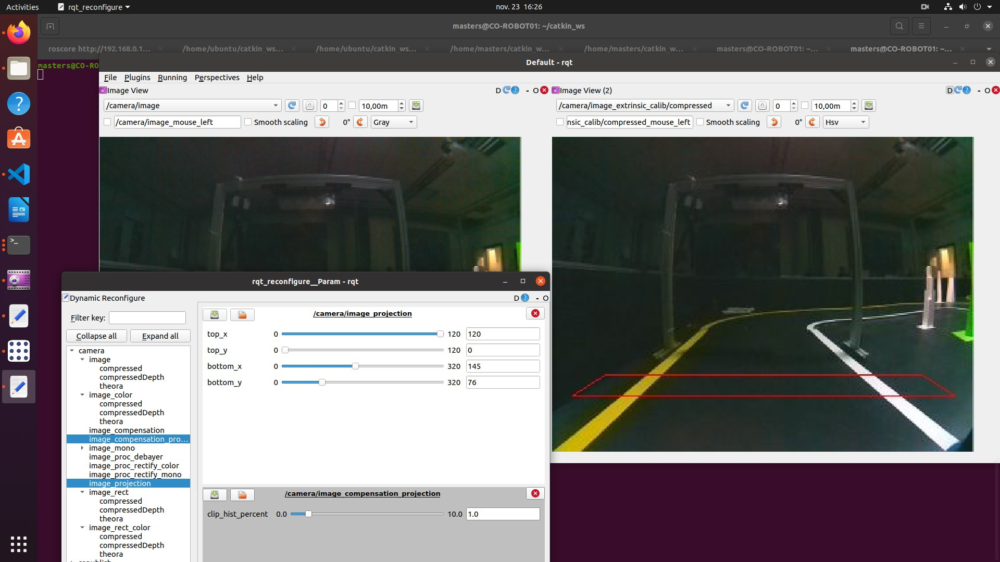
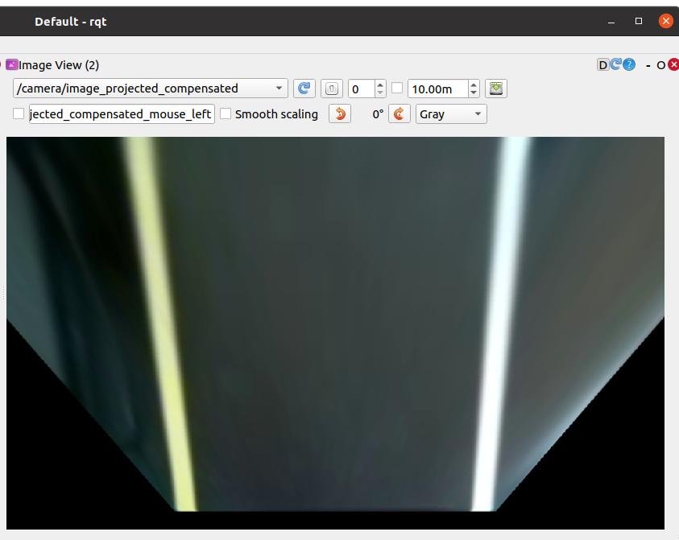

# ROSBot Harmony 1.0
- Turtlebot3 and Niryo-Ned2 Working together

#### ViBOT_2023/Group3: Nauman Shafique HASHMI, Atanda Abdullahi Adewale and Qian Zhiling

## Intro/Project Abstract:

The autonomous driving meaning enabling robot drive itself without any external intervention, is the future of industrialization. In the current era of industrial automation where many many of the jobs are replaced by the autonomous robots describes its importance in robotics and a need for a study. 

The objective of this project is to detect lane (yellow and white line in an unstable light condition) perform autonomous lane driving of turtlebot3 (TB3) robot and to establish communication a Niryo Ned2 robot in a ROS (Robot Operating System) environment. 

 

The project mainly covers the following things: camera intrinsic calibration, camera extrinsic calibration, Camera HSL parameter tuning for lane detection
TurtleBot3 is then tasked with moving until it detects a QR ArUco tag, at which point it communicates with the Niryo Ned2 robot through ROS messages. The Niryo Ned2 then performs certain actions {pick and place an object on TB3} and communicates back to the TurtleBot3 when done, allowing it to resume its movement

To enable communication between the PC, acting as the ROS master, and TurtleBot3 as well as Niryo, the ROS_MASTER_URI and ROS_IP parameters on both robots are set to the PC's IP address to form a ROS network group, facilitating the exchange of information through ROS topics

## Camera Calibration:

No camera is 100% perfect, each comes with inherent imperfections, often stemming from aberrations caused by faulty lenses or assembly defects in camera parts. Primarily, lens-related distortions manifest as radial and tangential distortions. Radial distortions, namely Barrel and Pincushion distortions, are prevalent. These deviations hinder the preservation of straight or parallel lines, causing them to seemingly converge towards infinity, termed as the Vanishing Point.
Barrel distortion causes parallel lines to curve outward, while Pincushion distortion makes parallel lines appear to curve inward. But there are some cameras which are deliberately made with those distortions. Such as cameras with Fish eye lenses. And the idea behind is that we can obtain a wider field of view with them. One of such camera is used in our project equipped with the following specifications: 
- Raspberry Pi Fish-eye Lens
- FOV: 160 degrees Diagonally
- Focal Length: 3.15mm

### Maths:
We used the large checkerboard for Intrinsic Camera Calibration

-Principles of Camera Imaging: 

Step 1: OpenCV did Harris corner detection first

Step 2: Solve the product of the intrinsic and extrinsic matrices: The product is a homography matrix

We set the world coordinate on the check board, so here R1 R2 means the first and second column of the matrix.

Step 3 solve intrinsic matrix:

Consider

Notate A as :

So we have: 

To solve out B, according to:

With at least 3 photos,we can solve the intrinsic parameters.

### Extrinsic Calibration
solve extrinsic matrix through

Finally, we need to mention that the automatic calibration tools considered Tackle radial distortion:

And tangential distortion:

### Callibration Results:

    <figure style="margin-right: 20px;">
        
        <figcaption>Before Calibration</figcaption>
    </figure>
    <figure>
        
        <figcaption>After Calibration</figcaption>
    </figure>
    <figure>
        
        <figcaption>camera perspective</figcaption>
    </figure>
     <figure>
        
        <figcaption>Bird eye view</figcaption>
    </figure>
    

#### This picture for intrinsic calibration taken from emanual.robotis.com for our explanation purposes. We had exactly the same result but missed to take picture

<h1><b>PART 2</b></h1>

### Lane Detection 

Once the calibraiton process is done, we are good to go for lane detection. At this point, creating an optimal lighting environment is pivotal for effective lane detection in TurtleBot3 operations. Because variations in luminance across the track present a significant challenge, with certain sections experiencing excessive light resulting in glare, while others remain comparatively darker. 

This discrepancy necessitates individualized HSL parameter configurations rather than a universal setting in the robotics lab for every lighting condition. Extensive trials involving diverse light combinations were conducted in an attempt to balance the illumination across all track sections, yet none proved successful. However, barring the use of dual projection lights. These lights provided the flexibility to adjust orientation and intensity, enabling uniform illumination overthe entire track.
For tuning the camera parameters We operated on 5600k temperature with 100% intensity value.

### Lane Detection Algorithm:

Algorithm Steps

      Thresholding
      Apply Perspective Transformation to Get a Bird’s Eye View
      Identify Lane Line Pixels
      Line Fitting thorugh the White piexels detected 
      Set Sliding Windows for White Pixel Detection
      Overlay Lane Lines on Original Image
      Display Final Image

### Lane Detection Results

-Algorithm Steps

Autorace package detect the lanes (yellow and white) using thresholding. The thresholding is performed based on the low and high HSL values of both the lanes. Every pixel value below the lower threshold replaced with  ‘0’ black pixel and very pixel value above the thresholding is turned to ‘1’ white pixel, thus resulting in a binary image. Now that we have binary images for both the lanes, the next step is creating a masks of those lanes which serve as ROI for further processing.
After having the masked values, bitwise AND operations is performed between the original HSL image and masked images, this will result in filtering out each colored lane.

 def maskWhiteLane(self, image):
        # Convert BGR to HSV
        hsv = cv2.cvtColor(image, cv2.COLOR_BGR2HSV)

        Hue_l = self.hue_white_l
        Hue_h = self.hue_white_h
        Saturation_l = self.saturation_white_l
        Saturation_h = self.saturation_white_h
        Lightness_l = self.lightness_white_l
        Lightness_h = self.lightness_white_h

        # define range of white color in HSV
        lower_white = np.array([Hue_l, Saturation_l, Lightness_l])
        upper_white = np.array([Hue_h, Saturation_h, Lightness_h])

        # Threshold the HSV image to get only white colors
        mask = cv2.inRange(hsv, lower_white, upper_white)

        # Bitwise-AND mask and original image
        res = cv2.bitwise_and(image, image, mask = mask)

        fraction_num = np.count_nonzero(mask)

        if self.is_calibration_mode == False:
            if fraction_num > 35000:
                if self.lightness_white_l < 250:
                    self.lightness_white_l += 5
            elif fraction_num < 5000:
                if self.lightness_white_l > 50:
                    self.lightness_white_l -= 5

        how_much_short = 0

        for i in range(0, 600):
            if np.count_nonzero(mask[i,::]) > 0:
                how_much_short += 1

        how_much_short = 600 - how_much_short

        if how_much_short > 100:
            if self.reliability_white_line >= 5:
                self.reliability_white_line -= 5
        elif how_much_short <= 100:
            if self.reliability_white_line <= 99:
                self.reliability_white_line += 5

        msg_white_line_reliability = UInt8()
        msg_white_line_reliability.data = self.reliability_white_line
        self.pub_white_line_reliability.publish(msg_white_line_reliability)

        if self.is_calibration_mode == True:
            if self.pub_image_type == "compressed":
                # publishes white lane filtered image in compressed type
                self.pub_image_white_lane.publish(self.cvBridge.cv2_to_compressed_imgmsg(mask, "jpg"))

            elif self.pub_image_type == "raw":
                # publishes white lane filtered image in raw type
                self.pub_image_white_lane.publish(self.cvBridge.cv2_to_imgmsg(mask, "bgr8"))

        return fraction_num, mask

The next step is marking those filtered lanes. AutoRace does this using two methods:
- Fitting a second order polynomial line in the detected lanes using the existing coefficient of the lane
-using sliding window method. 

# To Run this code

To Run the code we need to do following steps on remote PC and Turtlebot.

- Run ros master on PC. 

      roscore
 
- Connecting to Turtlebot3

  Connecting to turtlebot over ssh with password napelturbot

      ssh ubuntu@192.168.0.200
      
- Bring Up Turtlebot on PI.

     roslaunch turtlebot3_bringup turtlebot3_robot.launch 

-Start Capturing from Camera.

     roslaunch turtlebot3_autorace_camera raspberry_pi_camera_publish.launch
     
- On PC we have to run following files to start lane detection and tracking in seprate terminals.
         
      roslaunch group_4 extrinsic_calibration.launch
      roslaunch group_4 intrinsic_calibration.launch 
      roslaunch group_4 lane_detection.launch 
      roslaunch group_4 controller.launch
- In another terminal open 

      rqt_image_view

The results can be viewed on the topics.

      /camera/image/compressed
      /camera/image_projected/compressed/ 
Thresholding results on 
      
      /camera/mask_lane_detected/compressed
Final lane detection on 

      /camera/midlane_detected/compressed

## Demo and Trial Videos

**Previous Trial Video.

  

**Complete Run Video.

  

<h1><b>PART 3</b></h1>
## Communication

This part demonstrates the interaction between two robots: Turtlebot3 and Niryo Ned2. The Turtlebot3 sends a message to the Niryo Ned2 robot indicating that it has stopped. The Niryo Ned2 robot then proceeds to perform a vision pick, place the object, and return to the initial pose. TB3 resumes self driving.
The communication between the two robots is facilitated through a ROS topic called "channel_turtle_niryo".

Network Config:
on Ubuntu, edit <b>/etc/network/interfaces </b>
Set the IPv4 Address to 192.168.0.100 on PC, 192.168.0.200 on TB3 and 192.168.0.150 on Niryo Ned2

Then set network group:
<pre>
    export ROS_MASTER_URI=http://192.168.0.100:11311
    export ROS_IP=192.168.0.100
</pre>
on Pc, repeat on TB3 and Niryo, set their IP respectively. ping the PC or telnet 192.168.0.100 11311 from each robot toconfirm connection.   

Create a packeage <b>robot_com</b> with a node <b>ned2.py</b>, make executable with <pre> chmod +x ned2.py </pre>
make a msg dir, for custom message below   

Connectniryo.msg:
A custom ROS message type used for communication between TurtleBot3 and Niryo Ned2.
<pre>
    bool detected
    bool finished
</pre>

dont forget to build the pacakge in the workspace directory i.e <pre>catkin build </pre>  

use <pre>rosrun robot_com ned2<pre>

[1]:https://emanual.robotis.com/docs/en/platform/turtlebot3/autonomous_driving/#autonomous-driving
[2]: https://automaticaddison.com/the-ultimate-guide-to-real-time-lane-detection-using-opencv/
